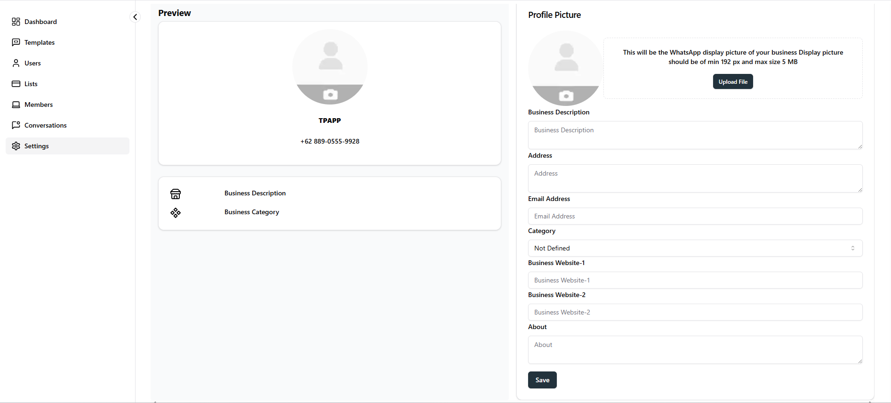

# WA Profile Settings

Thinking about giving your WhatsApp Business profile a fresh look? You can easily access it through Dashboard \> Settings \> WA Profile.

While updating your profile is optional, it’s a great way to build trust and connect better with your WhatsApp audience.

| Detail               | Description                                                                                                                                                                                                                                                                                                      |
| -------------------- | ---------------------------------------------------------------------------------------------------------------------------------------------------------------------------------------------------------------------------------------------------------------------------------------------------------------- |
| Profile Picture      | Upload a high-quality, visually appealing image that represents your brand. This will be the first visual impression users receive when interacting with your business.  **Photo Guidelines:** • Minimum resolution: 192 px • Maximum file size: 5 MB • Square aspect ratio recommended |
| Business Description | Provide a concise yet meaningful overview of your business, highlighting your primary offerings, services, or key differentiators.                                                                                                                                                                               |
| Address              | Enter the complete physical address of your business to help users accurately identify your location.                                                                                                                                                                                                            |
| Email Address        | Provide a valid business email address where customers or partners can contact you. This helps establish credibility and supports communication.                                                                                                                                                                 |
| Category             | Select the category that best represents your business. This helps users quickly understand the type of products or services you offer.                                                                                                                                                                          |
| Business Website 1   | Enter your primary business website or main online presence to help users learn more about your brand and services.                                                                                                                                                                                              |
| Business Website 2   | Add an additional website link if your business has multiple online platforms, such as a portfolio, landing page, or secondary site.                                                                                                                                                                             |
| About                | Write a brief description or key information about your business. You can highlight your mission, values, or what sets you apart.                                                                                                                                                                                |